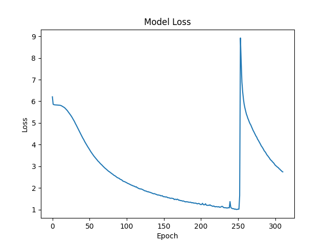
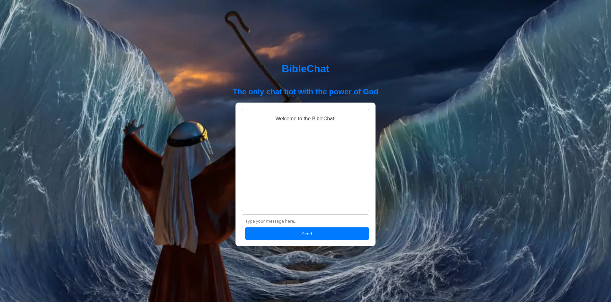

# Aplikacja - chat bot

Projekt składa się z 4 modeli, programów treningowych oraz części frontendowej. Modele trenowane były na tekstach:

- "King James Bible"
- "The Communist Manifesto"
- "The Little Match Girl"

### Projekt zawiera 4 modele.

## Model 1

Pierwszy model został wytrenowany z użyciem fine tuningu (w oparciu o model GPT2) na fragmencie (około 24,5 tysiąca słów) Bibli. Model radzi sobie dobrze z tworzeniem poprawnych gramatycznie zdań niemniej nie nadaje sie do generowania dłuższych treści z
powodu ciągłego powtarzania drugiej połowy pierszego wygenerowanego zdania. Model został przeze mnie wykorzystany do stworzenia prostej aplikacji w stylu chat bota korzystającej z frameworka "Flask".

## Model 2

Drugi model również korzysta z fine tuningu (również GPT2). Został on wytrenowany na "The Communist Manifesto" Karla Marx połączonym z "The Little Match Girl" Hansa Christiana Andersena. Podobnie jak w przypadku modelu pierwszego otrzymujemy dość sensowne odpowiedzi, niestety ponownie model zapętla się przy próbie wygenerowania dłuższych zdań.
Ten model również został przeze mnie wykorzystany do stworzenia aplikacji chat z działającej z użyciem frameworka "Flask"

## Model 3

Trzeci model wytrenowany został z użyciem LSTM. Model również radzi sobie dobrze z tworzeniem poprawnych zdań, ale nie z dłuzszymi wypowiedziami.

### Wykres opisujący training loss

Co ciekawe w epoce 250 wystąpiło 9-krotne zwięszenie straty która natychmiast zaczęła ostro spadać.

## Model 4 

Model wytrenowany z użyciem prostej techniki RNN. Zgodnie z oczekiwaniami model radzi sobie słabo z generowaniem tesktu ze względu na niskie wyrafimowanie techniki RNN.

## Aplikacje

Do stworzenia obu apikacjii wykorzystany został framework "Flask".

### Aplikacja 1

Aplikacja wytrenowana na Manifeście Komunistycznym połaczonym z Dziewczynką z zapałkami.

### Aplikacja 2 

Aplikacja wytrenowana na fragmentach Bibli.

## Wnioski 

Modele korzystające z fine tuningu radzą sobie zdecydowanie najlepiej z generowaniem tesktu. Mają jednak problem z odnoszeniem się do wcześniejszych elemntów konwersacji.